<div align="center">
  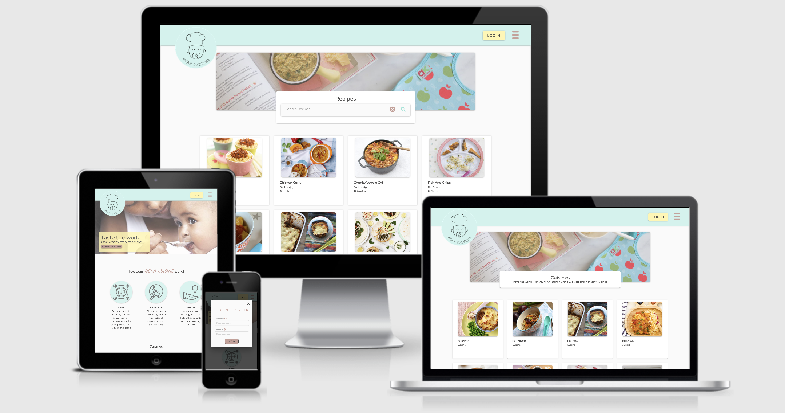
  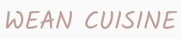
<hr>

**A recipe site that allows users to connect, explore, and share their weaning recipes.**

This app was built using [GitHub](https://pages.github.com/) and deployed to [Heroku](https://www.heroku.com/).

[Explore Wean Cuisine](https://wean-cuisine.herokuapp.com/)

</div>

---

## <u>Table of contents</u>

**<details><summary> User Experience (UX)</summary>**
  - [Purpose](#purpose)
  - [Design](#design)
  - [User stories](#user-stories)
  - [Wireframes](#wireframes)
</details>

**<details><summary> Features</summary>**
  - [Features used](#features-used)
  - [To do list](#to-do-list)
  - [Status](#status)
</details>

**<details><summary> Technologies</summary>**
  - [Languages](#languages)
  - [Frameworks, Libraries & Programs](#frameworks-libraries-programs)
</details>

**<details><summary> Deployment</summary>**
  - [Deploy to Heroku](#deploy-to-heroku)
  - [Accessing code](#accessing-code)
</details>

**<details><summary> Testing</summary>**
  - [Testing Documentation](https://github.com/Lucyjpjones/wean-cuisine/blob/master/testing.md)
</details>

**<details><summary> Credits</summary>**
  - [Content](#content)
  - [Media](#media)
  - [Acknowledgements](#acknowledgements)
</details>

**<details><summary> Contact</summary>**
  - [Contact details](#contact-details) 
</details>
---

# &rarr; **User Experience (UX)**

### **<u>Purpose</u>**

The purpose of this app is to create a platform where parents can connect, explore, and share weaning recipes, with a specific focus on different cuisines. 

Baby-led weaning is becoming an increasingly popular way of introducing babies to different foods, carrying many benefits including the ability to simplify feeding times for parents, better appetite control, less fussiness around foods, and protection against obesity later in life.

From living in London, one of the world's most diverse cities, I am spoilt for choice when it comes to dining out. I want children to experience different cultural cuisines from an early age as I think this will have a positive impact on their palettes later in life.

I was inspired to create this application after finding out I was due to become an Auntie in December.

By completing this project I will have shown greater experience in HTML, CSS, and Javascript, and demonstrated my understanding of Python+Flask and MongoDB. The project focuses on the concept of <u>CRUD</u>, creating functionality for users to create, locate, display, edit and delete recipes.

### **<u>Design</u>**

**Structure**

- A simple design structure with a fixed navbar and a dropdown side navigation menu accessible from every page. A brand logo is displayed in the top left of the screen to allow easy navigation back to the homepage.

- As well as including a page title on my base.html, I have also added the meta description tag to help optimize my click-through rate from search engine result pages.

**Colour scheme**

- The #fafafa shade of white has been used for the main background throughout the site with all the forms using a #fff shade of white creating a slight contrast.

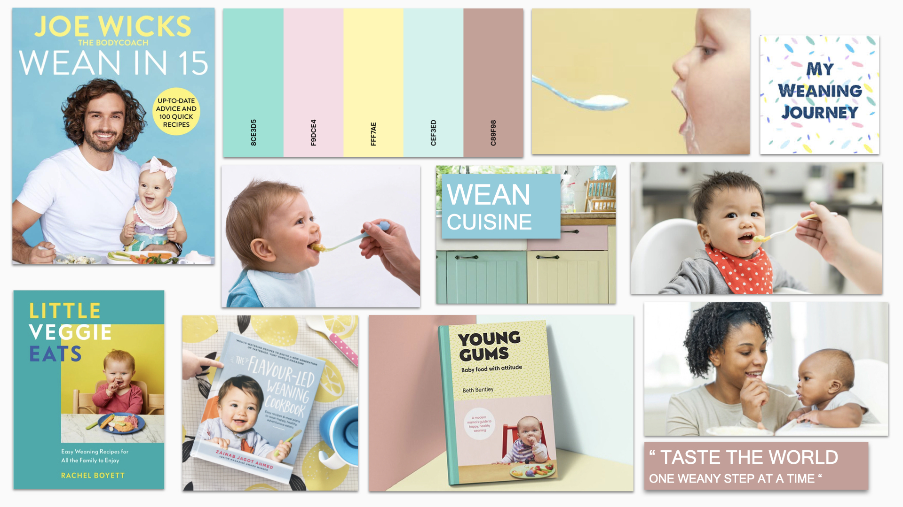

- After undergoing some research I decided a pastel colour scheme was appropriate for my app. I created my final palette using [Coolors](https://coolors.co).

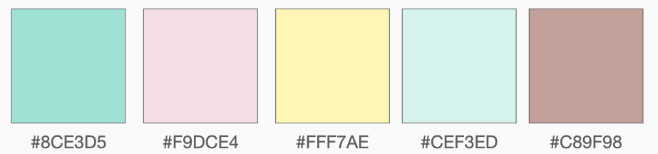

**Typography**

- The main font used throughout the site is 'Montserrat' which belongs to the sans-serif typeface family. The font is clean and elegant, making it a good choice for web design.

- I have used the 'Kalam' font for the 'Wean Cuisine' title as pairs well with my logo branding.

- Sans Serif as the fallback font if for any reason the font isn't being imported into the site correctly.

**Research**

- I spent some time researching other recipe sites to gain inspiration and created a mood board with a collection of elements that caught my eye.

  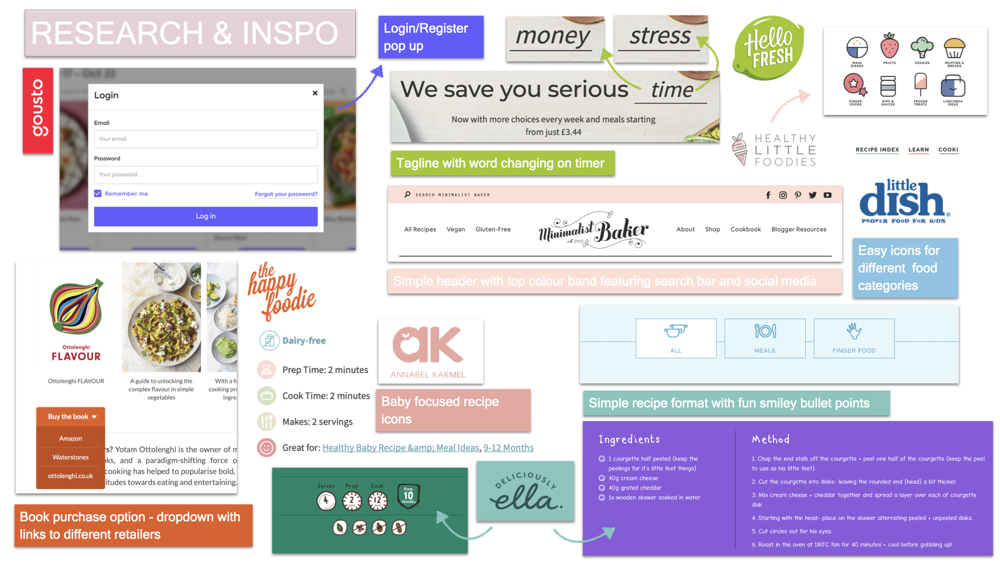

**Logo Design**

- For this site, I created my own logo design with inspiration from [Flaticon](https://www.flaticon.com/) and [VectorStock](https://www.vectorstock.com/).

- Following website conventions, my website logo is a link to the homepage. Over time through trial and error, many people have learned that clicking on a site’s logo leads them back to the homepage so adopting this standard reduces confusion by matching the UI to users’ expectations. The logo is also left-aligned which is the most familiar placement, and is where users look to find it.

  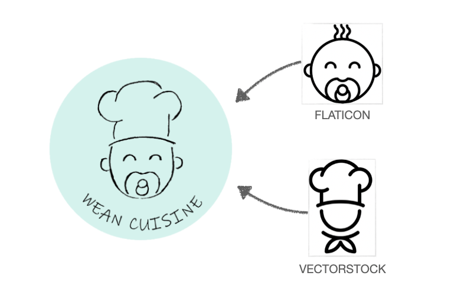

### **<u>User Stories</u>**

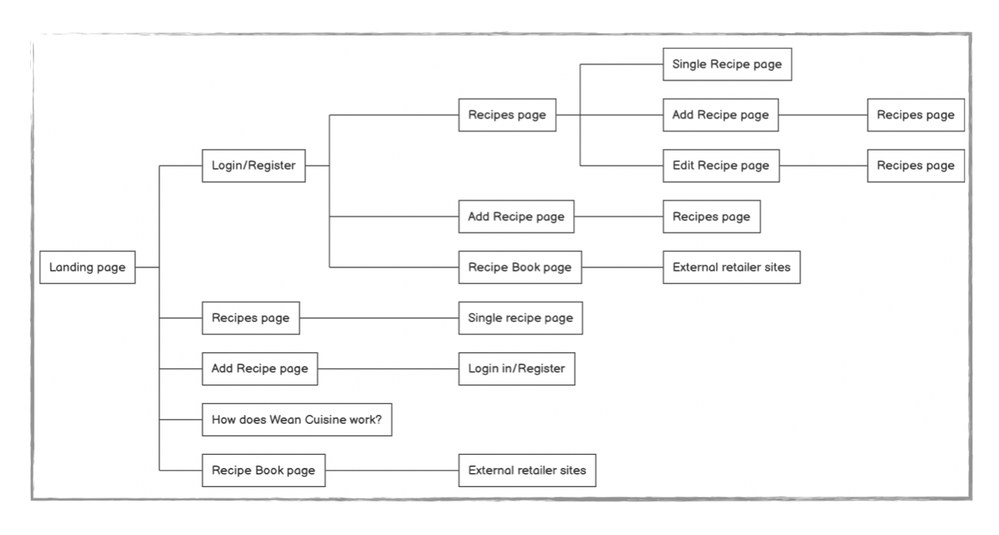

<u>**User profiles**</u>

**User profile: Site member**

As a first time mum, Katie wants to be able to connect with other parents from around the world to share inspiring weaning recipes. Since Katie is a working mum, anything she can do to save time in the kitchen without comprising on nourishment is highly valuable. She wants to share her experience with others and be part of a diverse community as she begins her weaning journey.

**User profile: Site owner**

As the site owner, I want to be able to continually monitor and update the site to manage my user's expectations. I have already got future development plans which I have highlighted in my features section below. As my site categorisation is based around cuisines I want to be able to log in as an admin user and add or update the listed cuisines for my users. By creating this application I will hopefully have gained inspiration on recipes I can cook for my niece and own children in the future.

<u>**User stories**</u>

**User stories: Site member**

|   | Needs/Goals                                                 | Task                                                                             |
|---|-------------------------------------------------------------|----------------------------------------------------------------------------------|
| **1** | An easy-to-use recipe site                                  | Simple, user-friendly site that is easy to navigate                              |
| **2** | Be part of a social community with other parents           | Ability to register and an easily accessible button to 'Log in’                  |
| **3** | Discover and learn new nourishing recipes                   | Explore recipes posted by others                                                 |
| **4** | Save time in the kitchen by getting inspiration from others | Clear recipe categorisation and search bar to allow quick browsing |
| **5** | Ability to share and edit her own recipes                   | Option to add, edit and delete own recipes                                       |
| **6** | Ability to find further inspiration                         | Links for purchasing recipe books for further inspiration                        |

**User stories: Site owner**


|   | Needs/Goals                                                 | Task                                                                             |
|---|-------------------------------------------------------------|----------------------------------------------------------------------------------|
| **1** | Ability to share and edit my own recipes                             | Option to add, edit and delete own recipes 
| **2** | Ability to manage cuisine cards           | When logged in as admin user, have the option to add, update and delete cuisine cards                  |


### **<u>Wireframes</u>**

As part of the design process, before starting my project I sketched out initial drawings then used [Balsamiq](https://balsamiq.com/?gclid=Cj0KCQjw28T8BRDbARIsAEOMBczzBYzsoMjbTtqNXQaE1EgOWA2u_Qux7sLl2IUHe-p0lDC-294BfVgaAr-oEALw_wcB) to create sharper-looking wireframes. Creating these mock-ups helped me plan the basic structure and arrangement of the features for my site.

- [Homepage](static/assets/files/wf-homepage.pdf)
- [Recipes page](static/assets/files/wf-recipes.pdf)
- [Add/Edit recipe page](static/assets/files/wf-addEditRecipe.pdf)
- [View recipe page](static/assets/files/wf-recipeInfo.pdf)
- [Shop recipe books page](static/assets/files/wf-shopRecipeBooks.pdf)

> **Note:** Pages focused around Cuisine to follow the same structure as recipe page wireframes.
---

## &rarr; **Features**

### **Features used**

- **Responsive on all device sizes**
  - Mobile-first design, responsive on all devices through using the Materialize grid system and CSS media queries.

- **A user-friendly interface with easy navigation throughout the site**
  - Attractive, minimalistic design with visuals and information presented clearly and concisely.

  - Easily readable fonts and simple navigation throughout the site.
    - Fixed navigation bar visible on every page including a menu dropdown and brand logo to link back to the homepage.

  - An aesthetically pleasing 404 page if the user is directed to a non-existent page.

- **Buttons**
    - Clear interactive buttons used for a effortless user journey.

- **Forms**
  - Forms used for login and register modal, and adding/editing recipes and cuisines.

  - Materialize form elements used include input fields, text area fields, radio buttons, select dropdowns and submit buttons.

- **Tabs**
  - Interactive tab used to allow the user to switch between recipe ingredients and method.

- **Card Listings**
  - Used to display recipes, cuisine categories, and recipe books.

  - Image included contributing to the visual look.

- **Modals**
  - Used for login and register form, and recipe and cuisine card delete confirmation.

- **Carousel**
  - Used for cuisine categories displayed on the homepage.

- **Search bar**
  - Allows the user to search recipes by keywords using text index searching. Recipe names, cuisine names, ingredients, and food categories are included as the keywords for the query.

- **Toasts**
  - Used for login and register form success responses.

- **Flash Messages**
  - Used for login and register form error responses.

### **To do list**

#### Status

> Project is: <u>ongoing</u>

I will continue to update my website as I grow my platform of users. I have future development plans which I have listed below.

**Future Development plans**
- I will continue to add more cuisine categories as I grow my user base.

- Add a review option so my users can share their options on recipes they have tried.

- Create a parent forum to add more social interaction between my users.

- Add Dietary requirements information to recipes information.

- Add age filter so parents can easily search recipes specific to their childs age.

- Add an email address input field on the registration modal so if a user forgets their password they can be sent a link to reset it.

- Change the image URL input to a media upload option.

---

## &rarr; **Technologies**

#### Languages

- [HTML5](https://en.wikipedia.org/wiki/HTML5)
- [CSS3](https://en.wikipedia.org/wiki/Cascading_Style_Sheets)
- [JavaScript](https://www.javascript.com/)
- [Python](https://www.python.org/)

#### Frameworks, Libraries & Programs

- [**MongoDB**](https://www.mongodb.com/)
  - The document database used for this project.

- [**Flask**](https://flask.palletsprojects.com/en/1.1.x/)
  - A web framework used to provide tools, libraries, and technologies for the application.

- [**Werkzeug**](https://werkzeug.palletsprojects.com/en/1.0.x/)
  - Used with Flask to make user authentication more secure using password hashing.

- [**Materialize CSS**](https://materializecss.com/)

  - Materialize was used to assist with the responsiveness and styling of the website using design templates.

- [**Randomkeygen**](https://randomkeygen.com/)

  - Fort Knox Passwords for password security.

- [**Google fonts**](https://fonts.google.com/)

  - Google fonts were used to import the fonts into the CSS file which is used on all pages throughout the project.

- [**Font Awesome 4.7.0**](https://fontawesome.com/)

  - Font Awesome was used to add icons for aesthetic and UX purposes.

- [**jQuery:**](https://jquery.com/)

  - jQuery came with Materialize to make the components used responsive.
  - Included at end of body tag within HTML file to ensure a smooth running of HMTL and CSS.

- [**Git**](https://git-scm.com/)

  - Git was used for version control by utilizing the Gitpod terminal to commit to Git and push to GitHub.

- [**GitHub**](https://github.com/)

  - GitHub is used to store the project code after being pushed from Git.

- [**Heroku**](https://github.com/)

  - Heroku is the app platform I deployed my project to.

- [**Balsamiq**](https://balsamiq.com/)

  - Balsamiq was used to create the wireframes during the design process.

- [**Grammarly**](https://www.grammarly.com/)

  - Grammarly was used to ensure any grammar errors are eliminated.

- [**HTML Formatter**](https://www.freeformatter.com/html-formatter.html) and [**CSS Formatter**](https://www.freeformatter.com/css-beautifier.html)

  - Used to format my HTML and CSS file with the desired indentation level for optimal readability.

- [**Tables Generator**](https://www.tablesgenerator.com/markdown_tables)

  - Used to create tables in my readme file.

- [**Favicon**](https://favicon.io/)
    - Used to create a favicon, displaying my logo on a web browser next to the web address bar, the browser tab, and the bookmarks bar.
    
---

## &rarr; **Deployment**

#### Deploy to Heroku

The project was connected to Heroku using automatic deployment from my GitPod repository, using the following steps...

> **Note:** Before following the below steps ensure you have already created your new repo in Github and set up an env.py file to store your sensitive data. (Further details on adding an env.py file below)

1. In the terminal create requirements.txt and Procfile files using the commands below:
   - $ pip3 freeze --local > requirements.txt

   - $ echo web: python app.py > Procfile

   > **Note:** 
The **P**rocfile must be assigned a capital P.

2. Log in (or Register) to [Heroku](https://www.heroku.com/) and from your dashboard click 'new' > 'create new app'.

   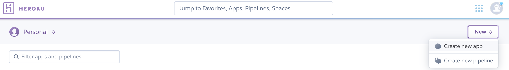

3. Enter your 'App name' and choose the appropriate region, then click 'Create app'.
   > **Note:** 
 The app name must be unique, all lowercase, and '-' to be used instead of spaces.
The region chosen should be the one closest to you.

   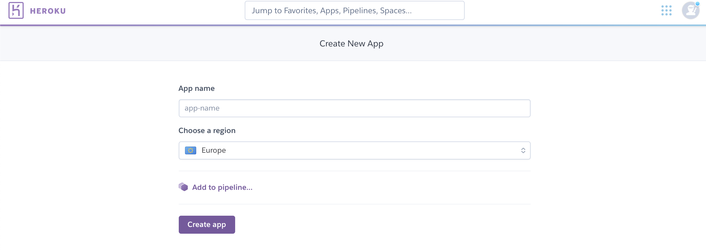

4. From the Heroku deploy tab, select the Deployment method 'GitHub'.

   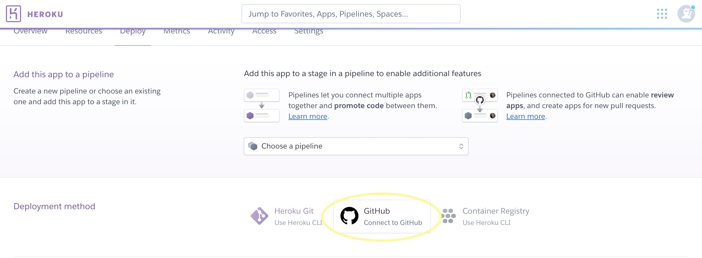

5. On the 'Connect to GitHub' section make sure your GitHub profile is displayed then add your repository name and click 'Search'.

   > **Note:** 
This is the name of your repo in GitHub. It is good practice to use an identical name for your Heroku app.

    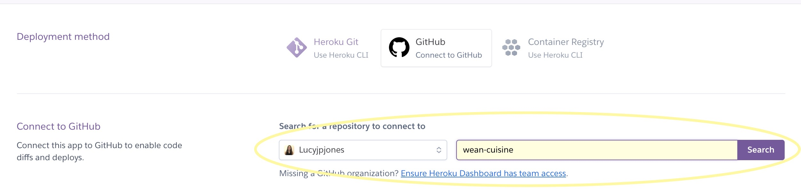

6. Your repo should now be displayed below, click 'Connect' to connect to this app.

7. Go to the Settings tab on Heroku, scroll to the 'Config Vars' section, and click 'Reveal Config Vars'. 

   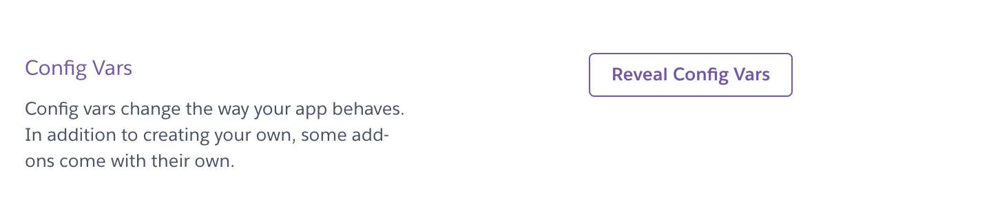

   Enter variables (key and value) contained in the env.py file. The keys are listed below and values are inputted by the user.
    - IP
    - PORT
    - SECRET_KEY
    - MONGO_URI
    - MONGO_DBNAME

8. Push requirements.txt and Procfile to repository:
  <u>requirements.txt</u>
    - $ git add requirements.txt
    - $ git commit -m "Added requirements.txt"
 
    <u>Procfile</u>
   - $ git add Procfile
   - $ git commit -m "Added Procfile"

9. Go to the Deploy tab on Heroku and under the Automatic deployment section, click 'Enable Automatic Deploys'. Then under Manual deploy click 'Deploy Branch'.

   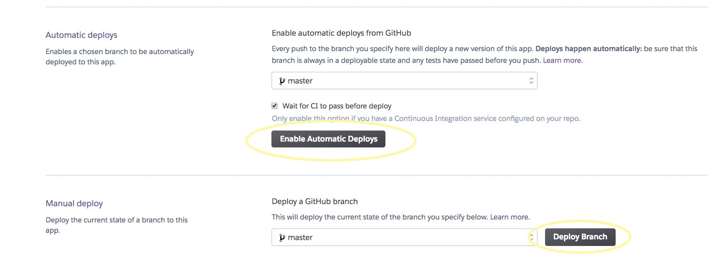

   - Heroku will now receive the code from GitHub and start building the app using the required packages.
   - Once built you will receive the message 'Your app was successfully deployed' and you can click 'View' to launch your new app.

        > **Note:** 
        In Manual deploy dropdown 'master' is selected'

#### Accessing code

Follow the steps below if you are wanting to propose changes to the project or to use the project as a starting point for your own idea.

- **Forking the GitHub Repository**

  Forking allows you to create a copy of the original repository and propose changes to the repository owner via a pull request.

  1. Log in to GitHub and locate the GitHub Repository.

  2. At the top of the Repository (not top of page) just above the "Settings" button on the menu, locate the "Fork" button.

     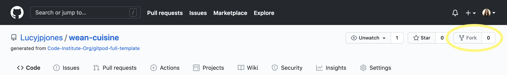

  3. You should now have a copy of the original repository in your GitHub account.

- **Making a Local Clone**

When you clone a repository, the repository is copied on to your local machine.

1. Log in to GitHub and locate the GitHub Repository.
   - Wean Cuisine repository can be found [here](https://github.com/Lucyjpjones/wean-cuisine/)

2. Under the repository name, click the "download code" option.

   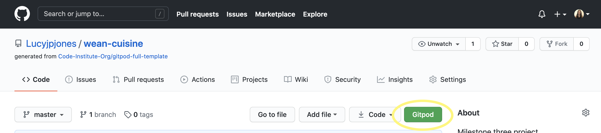

3. To clone the repository using HTTPS, under "Clone with HTTPS", copy the link.

   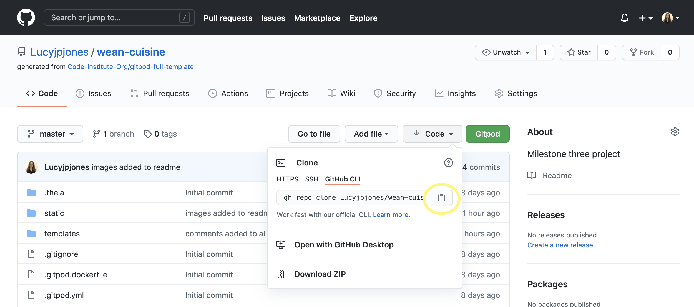

4. Open Git Bash

5. Change the current working directory to the location where you want the cloned directory to be made.

6. Type git clone, and then paste the URL you copied in Step 3.

    ```
    $ git clone https://github.com/YOUR-USERNAME/wean-cuisine.git
    ```

7. Press Enter. Your local clone will be created.

    ```
    $ git clone https://github.com/YOUR-USERNAME/wean-cuisine.git

    > Cloning into `wean-cuisine`...
    > remote: Enumerating objects: 299, done.
    > remote: Counting objects: 100%, (299/299),  done.
    > remote: Compressing objects: 100% (156/156), done.
    > Receiving objects: remove: Total 299 (delta 145), reused 267 (delta 126), pack-reused 0
    > Receiving objects: 100% (299/299), 4.61MiB | 2.98 MiB/s, done.
    > Resolving deltas: 100% (145/145), done. Unpacking objects: 100% (10/10), done.
    ```

    Now, you have a local copy of your fork of the Wean Cuisine repository.

    > **Note:** The repository name and output numbers that you see on your computer, representing the total file size, etc, may differ from the example I have provided above.

8. Add an env.py file to your workspace to include your environment variables (more details below).

   > **Note:** Contact the site owner if you want more information on the environment variables that have been included.

**Creating env.py file** 

1. Add a env.py file to store environment variables:
   - Import os 
   - os.environ.setdefault("IP", "To be added by user") 
   - os.environ.setdefault("PORT", "To be added by user") 
   - os.environ.setdefault("SECRET_KEY", "To be added by user") 
   - os.environ.setdefault("MONGO_URI", "To be added by user") 
   - os.environ.setdefault("MONGO_DBNAME", "To be added by user")

    > **Note:** I used [RandomKeygen.com](https://randomkeygen.com/) to get my secure SECRET_KEY password. A SECRET_KEY is required when using the flash and session functions of Flask.

 2. Create a file named .gitignore and include env.py to ensure this file is never pushed to GitHub.
    > **Note:** The env.py mustn't be tracked as any GitHub user can access your confidential data.

---

## &rarr; **Credits**

#### Content

- [Materialize 1.0.0](https://materializecss.com/): Materialize Library used throughout the project, components used include the grid System, forms, buttons, modals, navbar, dropdown, side nav, tabs, carousel, cards, toasts, and tooltips.

- [Stack overflow](https://stackoverflow.com/):
  - Code included in select.js file to fix select bug taken from [here](https://github.com/Dogfalo/materialize/blob/c0da34049deec36efbd4681f73b3446e92918ca8/js/select.js).
  - Code to fix console favicon error taken from [here](https://stackoverflow.com/questions/30693021/chrome-developer-tools-shows-favicon-404-error-in-brackets-livepreview).

- [HTML Dog](https://htmldog.com/techniques/404/): Helped with creating custom error page '404'.

- All recipes added by users lucyjpj (admin) and susan are taken from [Organix](https://www.organix.com/), [Annabel Karmel](https://www.annabelkarmel.com/) and [Baby Foode](https://babyfoode.com/). All other recipes have been added from user testing.

#### Media

> **Please note:** The images on this site are only being used for non-profit educational purposes.

- The callout image on the homepage is from ['About kids health'](https://www.aboutkidshealth.ca/article?contentid=635&language=english).

- [Flaticon](https://www.flaticon.com/) and [VectorStock](https://www.vectorstock.com/): used as inspiration for the Wean Cuisine logo.

- Icon circle images found on the homepage are from [Flaticon](https://www.flaticon.com/) and edited using [Paint S](https://apps.apple.com/gb/app/paint-s/id736473980?mt=12).

- The image used for the 'Shop recipe books' section on the homepage is from [The Reading List](https://readinglist.click/sub/cheesy-pea-quinoa-risotto-for-you-and-the-baby-from-joe-wickss-wean-in-15/).

- The images used for the callout on the recipes, cuisines, and books page are all from [Annabel Karmel](https://www.annabelkarmel.com/).

- All recipe images added by users lucyjpj (admin) and susan are from [Organix](https://www.organix.com/), [Annabel Karmel](https://www.annabelkarmel.com/) and [Baby Foode](https://babyfoode.com/) recipes. All other recipes have been added from user testing.

- Recipe book images are taken from [Amazon](https://www.amazon.com/).

- The mockup image showing all devices on my README.md was created using [Am I Responsive](http://ami.responsivedesign.is/).

#### Acknowledgments

- My Mentor, Aaron for his continuous help and support throughout the project.

- The help and support received from the tutors at [Code Institute](https://codeinstitute.net/).

- The [Code Institute](https://codeinstitute.net/) Slack Community.

- Friends & Family for continuous feedback and support.

## &rarr; **Contact**

#### Contact details

Created by @lucyjpjones

If you have any problems, questions or, suggestions for my project please contact me on the email below:

```
lucyjpjones@gmail.com
```

Thanks for visiting.

&copy;
LucyJPJones