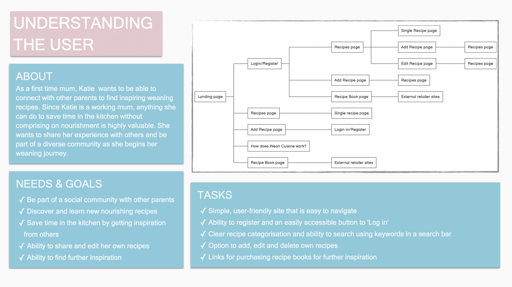

<div align="center">
  
  
<hr>

**A recipe site that allows users to connect, explore and share their own weaning recipes.**

This app was built using [GitHub Pages](https://pages.github.com/) and [Heroku](https://www.heroku.com/)

[View here](https://lucyjpjones.github.io/wean-cuisine/)

</div>

---

## <u>Table of contents</u>

- [&rarr; **User Experience (UX)**](#-rarr----user-experience--ux---)
  - [Purpose](#purpose)
  - [Design](#design)
  - [User stories](#user-stories)
  - [Wireframes](#wireframes)
- [&rarr; **Features**](#-rarr----features--)
  - [Features used](#features-used)
  - [To-do list](#to-do-list)
  - [Status](#status)
- [&rarr; **Technologies**](#-rarr----technologies--)
  - [Languages](#languages)
  - [Frameworks, Libraries & Programs](#frameworks--libraries---programs)
- [&rarr; **Deployment**](#-rarr----deployment--)
  - [Deploy to Github](#deploy-to-github)
  - [Accessing code](#accessing-code)
- [&rarr; **Testing**](#-rarr----testing--)
  - [Testing user stories](#testing-user-stories)
  - [Manual function testing](#manual-function-testing)
  - [Validator checks](#validator-checks)
  - [Audits](#audits)
  - [Responsive Design](#responsive-design)
  - [Additional Testing](#additional-testing)
  - [Bugs](#bugs)
- [&rarr; **Credits**](#-rarr----credits--)
  - [Content](#content)
  - [Media](#media)
  - [Acknowledgements](#acknowledgements)
- [&rarr; **Contact**](#-rarr----contact--)

---

# &rarr; **User Experience (UX)**

### **<u>Purpose</u>**

The purpose of this app is to create a platform where parents can connect, explore and share weaning recipes, with a specific focus on type of cuisine. 

Baby-led weaning is becoming an increasingly popular way of introducing babies to different foods, carrying many benefits including the ability to simplify feeding times for parents, better appetite control, less fussiness around foods, and protection against obesity later in life.

From living in London, one of the world's most diverse cities, I am spoilt for choice when it comes to dining out. I want children to experience different cultural cuisines from an early age as I think this will have a positive impact on their palettes later in life.

I was inspired to create this application after finding out I was due to become an Auntie in December.

### **<u>Design</u>**

**Structure**

**Colour scheme**


- After undergoing some research into baby focused websites and recipe books, I decided a pastel colour scheme was a appropriate for my app. I created my final palette using [Coolors](https://coolors.co).


**Typography**

**Research**

- I spent some time researching other recipe sites to gain inspiration, and created a moodboard with a collection of elements which caught my eye.


**Logo Design**

- For this site I created my own logo design with inspiration from [Flaticon](https://www.flaticon.com/) and [VectorStock](https://www.vectorstock.com/).


### **<u>User Experience</u>**



**User stories**

**1.** Simple, user-friendly site that is easy to navigate
 
**2.** Ability to register to site

**3.** Easily accessible button to 'Log in’ 

**4.** Clear recipe by cuisine categorisation

**5.** Ability to search using keywords in a search bar

**6.** Option to add recipes

**7.** Option to edit own recipes

**8.** Option to delete own recipes

**9.** Browse and purchase recipe books

### **<u>Wireframes</u>**

As part of the design process, before starting my project I sketched out initial drawings then used [Balsamiq](https://balsamiq.com/?gclid=Cj0KCQjw28T8BRDbARIsAEOMBczzBYzsoMjbTtqNXQaE1EgOWA2u_Qux7sLl2IUHe-p0lDC-294BfVgaAr-oEALw_wcB) to create sharper-looking wireframes. Creating these mock-ups helped me plan the basic structure and arrangement of the features for my site.

- [Homepage](static/assets/files/wf-homepage.pdf)
- [Recipes page](static/assets/files/wf-recipes.pdf)
- [Add/Edit recipe page](static/assets/files/wf-addEditRecipe.pdf)
- [Recipe information page](static/assets/files/wf-recipeInfo.pdf)
- [Shop recipe books page](static/assets/files/wf-shopRecipeBooks.pdf)

---

## &rarr; **Features**

#### Features used:

#### To-do list:

#### Status

**Future Development plans**

---

## &rarr; **Technologies**

#### Languages

#### Frameworks, Libraries & Programs

---

## &rarr; **Deployment**

#### Deploy to Github

#### Accessing code

- **Forking the GitHub Repository**

- **Making a Local Clone**

---

## &rarr; **Testing**

#### Testing user stories


#### Manual function testing

#### Validator checks

#### Audits

#### Responsive Design

#### Additional Testing

#### Bugs

## &rarr; **Credits**

#### Content

#### Media

- [Flaticon](https://www.flaticon.com/) and [VectorStock](https://www.vectorstock.com/): used as inspiration for the Wean Cuisine logo.

#### Acknowledgements

## &rarr; **Contact**

Created by @lucyjpjones

If you have any problems, questions or suggestions for my project please contact me on the email below:

```
lucyjpjones@gmail.com
```

Thanks for visiting.

&copy;
LucyJPJones